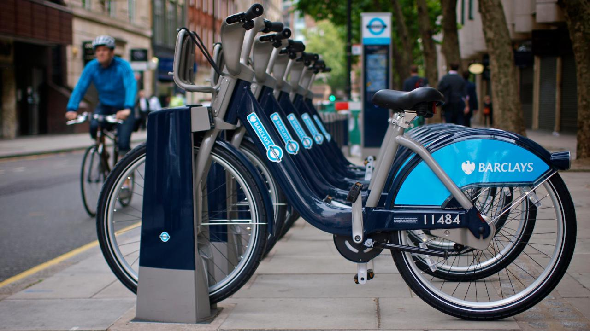

## Makers Academy - Week 1 Pair Programming Project

# Boris-Bikes
=================

[Task](#Task) | [User Stories](#stories) | [Installation](#Installation) |

Technologies: Ruby, RSpec

## Task

We start our Makers journey by looking into the funtionality of the Boris Bike system around London. Our task is to recreate this great addition to the London transport network within our virtual platform. We have been given a selection of User Stories for us to break down into manageably funtions and incorperate into our program. 

